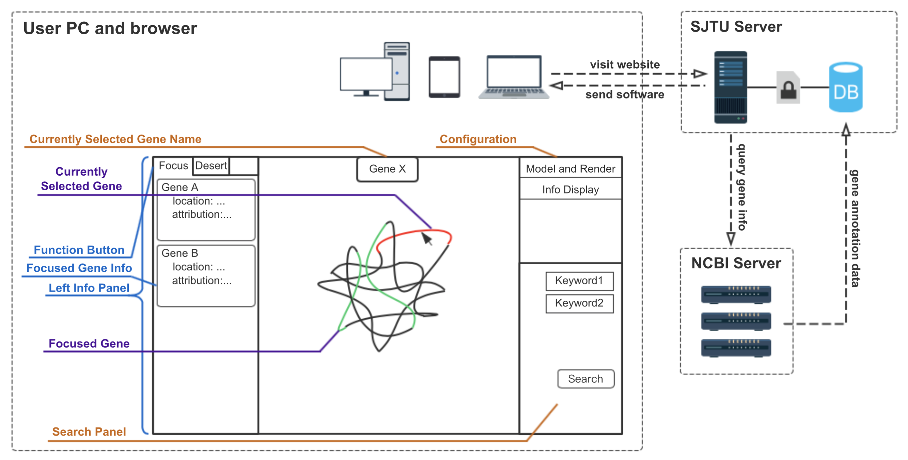

3DGenome

**TO DO LIST**

- [x] Better TrackballControl
- [x] MousePick config GUI
- [x] MousePick multi-select
- [x] Multi-select trigger
- [x] Disp mouse pick info
- [x] Global
- [x] Invalidate picked object
- [x] Favicon
- [x] Select from leftInfoPanel
- [x] Button in leftInfoPanel
- [ ] sprite
- [x] leftInfoPanel template
- [ ] Pretty search panel
- [ ] Better search choice
- [ ] Auto-fill
- [ ] Minimize several css and js
- [ ] Full-text index
- [ ] search result page
- [x] blank search key
- [x] population
- [ ] CSS select + input

Current
- [ ] Focus search results
- [ ] Auto viewpoint
- [ ] Gradient render (color)

Critical
- [x] BUG: INDEX should not be used as unique identifier
- [x] BUG: Loading file sequence
- [x] Disp selected object info (info panal)
- [x] Search Panel
- [x] List of search
- [x] Loader
- [x] Backstage data structure
- [ ] Integrate all 23 CHRs
- [ ] Bind search and focus

Long Term
- [ ] User input desired range 
- [x] TypeScript? No
- [ ] dat.GUI

Minor Improvement
- [ ] GUI cache
- [x] Light Position
- [ ] Reset trackball location
- [ ] Auto-rotation
- [ ] Auto-adjust camera
- [ ] Mouse position detection potential bug
- [ ] Deprecate ejs

WARNING
- All objects may be destructed by re-render
- Empty geometry object is not allowed.
- Change of onPick/onFocus behavior is bug-prone
